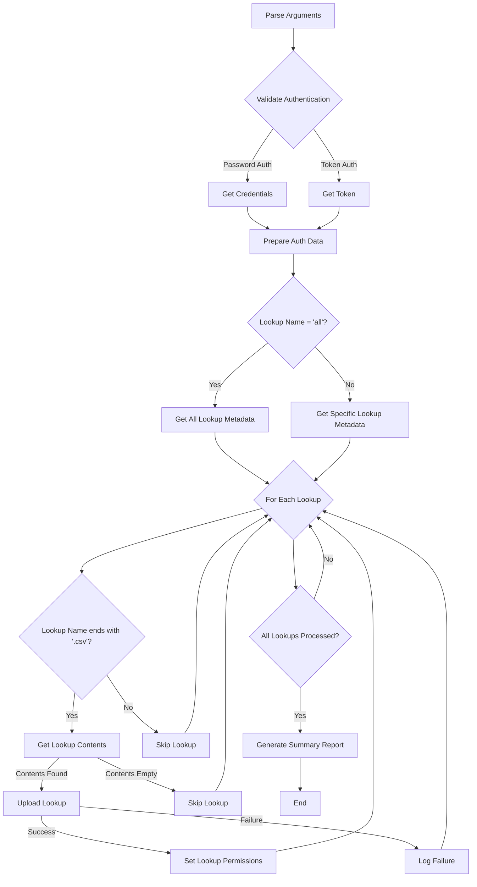

# splunk_rest_upload_lookups

`splunk_rest_upload_lookups.py` is a Python 3 script designed to transfer Splunk lookup CSV files between Splunk instances.  It leverages the Splunk Lookup Editor (https://splunkbase.splunk.com/app/1724) app's REST endpoints to efficiently pull lookups from a source Splunk environment and upload them to a destination Splunk environment.

This script can transfer a single specified lookup or all lookups within a given application, while also preserving the original lookup owner and access control list (ACL) permissions. In the case of a search head cluster, the uploaded lookup will be replicated to the other cluster members.

## Requirements

    Python 3
    requests Python library 
    Splunk Lookup Editor app (https://splunkbase.splunk.com/app/1724) v4.0.4+ installed on both the source and destination Splunk instances.

## Usage

The script uses command-line arguments for flexibility. You must specify details for both the source and destination Splunk instances, as well as the lookup(s) to transfer.
Shell

```bash
./splunk_rest_upload_lookups.py \
    --src-host <SOURCE_SPLUNK_HOST> \
    --src-port <SOURCE_SPLUNK_PORT> \
    --src-authtype {password|token} \
    [--src-username <USERNAME>] \
    [--src-password <PASSWORD>] \
    [--src-token <TOKEN>] \
    --src-app <SOURCE_APP> \
    --dst-host <DESTINATION_SPLUNK_HOST> \
    --dst-port <DESTINATION_SPLUNK_PORT> \
    --dst-authtype {password|token} \
    [--dst-username <USERNAME>] \
    [--dst-password <PASSWORD>] \
    [--dst-token <TOKEN>] \
    [--dst-app <DESTINATION_APP>] \
    --lookup-name {<LOOKUP_NAME.csv>|all} \
    [--overwrite-existing] \
    [--debug] \
    [--verbose]
```

## Arguments

    Source Connection (`--src-host`, `--src-port`, `--src-app`):
        --src-host: Hostname or IP of the source Splunk instance.
        --src-port: REST API port of the source Splunk instance (e.g., 8089).
        --src-app: The Splunk app on the source instance where the lookup(s) reside.

    Source Authentication (`--src-authtype`, `--src-username`, `--src-password`, `--src-token`):
        --src-authtype: Choose password for username/password authentication or token for Splunk token authentication.
        --src-username: Required if --src-authtype is password.
        --src-password: Required if --src-authtype is password. Will prompt if not provided.
        --src-token: Required if --src-authtype is token. Will prompt if not provided.

    Destination Connection (`--dst-host`, `--dst-port`, [`--dst-app`]):
        --dst-host: Hostname or IP of the destination Splunk instance.
        --dst-port: REST API port of the destination Splunk instance (e.g., 8089).
        --dst-app: The Splunk app on the destination instance to upload lookups to. If not specified, it defaults to the --src-app value.

    Destination Authentication (`--dst-authtype`, `--dst-username`, `--dst-password`, `--dst-token`):
        --dst-authtype: Choose password for username/password authentication or token for Splunk token authentication.
        --dst-username: Required if --dst-authtype is password.
        --dst-password: Required if --dst-authtype is password. Will prompt if not provided.
        --dst-token: Required if --dst-authtype is token. Will prompt if not provided.

    Lookup Specification (`--lookup-name`):
        --lookup-name: Specify the exact name of the lookup file (e.g., my_lookup.csv) or use all to transfer all CSV lookups from the source app. Only CSV lookups are supported.

    Transfer Options (`--overwrite-existing`):
        --overwrite-existing: Use this flag to overwrite lookup files that already exist on the destination. By default, existing lookups are skipped.

    Debug Options (`--debug`, `--verbose`):
        --debug: Enables debug logging, providing more detailed information about script execution.
        --verbose: Enables verbose HTTP request/response logging, useful for troubleshooting API calls.

## Features

    Cross-Instance Transfer: Easily move lookups between different Splunk environments.
    Flexible Lookup Selection: Transfer a single specified lookup file or all CSV lookups within a source app.
    Authentication Options: Supports both traditional username/password and Splunk Token authentication for source and destination.
    Owner and ACL Preservation: Attempts to maintain the original lookup owner and access control list (ACL) settings (sharing, read, and write permissions) on the destination. If the owner doesn't exist on the destination, it will be created.
    Overwrite Control: Choose to skip existing lookups or overwrite them.
    Robust Network Handling: Includes retry logic with exponential backoff for network requests to improve reliability.
    Detailed Reporting: Provides a comprehensive summary of successful, skipped, and failed transfers at the end of the script run, along with reasons for skips/failures.

Examples
Example 1: Transferring a single lookup using password authentication
Shell

```bash
./splunk_rest_upload_lookups.py \
    --src-host srchost.customer.net \
    --src-port 8089 \
    --src-authtype password \
    --src-username admin \
    --src-app search \
    --dst-host customername.splunkcloud.com \
    --dst-port 8089 \
    --dst-authtype password \
    --dst-username splunk_admin \
    --dst-app my_app \
    --lookup-name my_users.csv \
    --overwrite-existing
```

(You will be prompted for both source and destination passwords if not provided on the command line)
Example 2: Transferring all lookups from an app using token authentication
Shell

```bash
./splunk_rest_upload_lookups.py \
    --src-host onprem-sh.internal \
    --src-port 8089 \
    --src-authtype token \
    --src-token "eyJraWQiOiJmMTIzYWJj..." \
    --src-app audit \
    --dst-host cloud-sh.external.com \
    --dst-port 8089 \
    --dst-authtype token \
    --dst-token "ZXlKaGJHY2lPaUpyWVc1c..." \
    --lookup-name all \
    --debug
```

## Notes about Permissions

To successfully transfer lookups, the Splunk user accounts used for both source and destination must have appropriate permissions:

    Source User: Needs at least read access to the lookups within the specified source app.
    Destination User: Needs write access to create and modify lookups within the specified destination app. This typically includes the edit_lookups capability. If the script attempts to set an owner that does not exist on the destination, the destination user might also need permissions to create users or manage users if the original owner needs to be created on the destination.

## Application Workflow



## Attributions

- The Python script is based on work referenced in https://community.splunk.com/t5/Splunk-Search/Can-you-create-modify-a-lookup-file-via-REST-API/m-p/193671 from this repository: https://github.com/mthcht/lookup-editor_scripts
- Originally developed by Becky Burwell in this repository: https://github.com/beckyburwell/splunk_rest_upload_lookups on Apr 27, 2023
- Updated by Darren Fuller to https://github.com/darrenfuller/splunk_rest_upload_lookups on Jun 6, 2025
